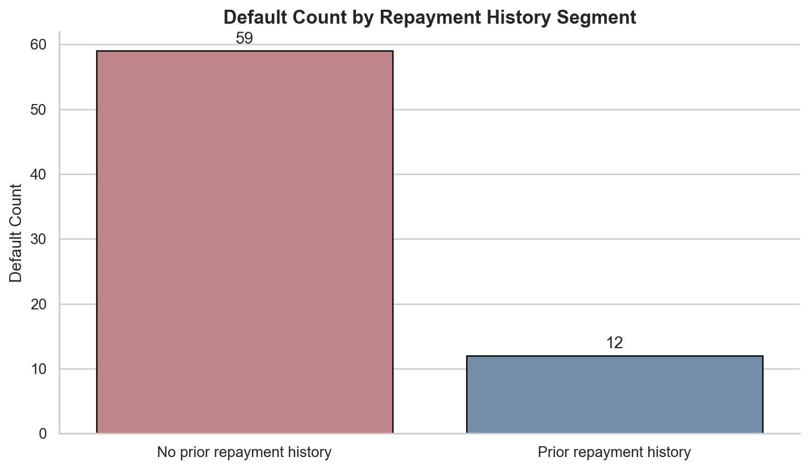
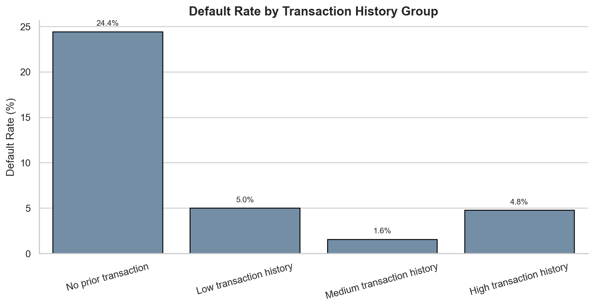
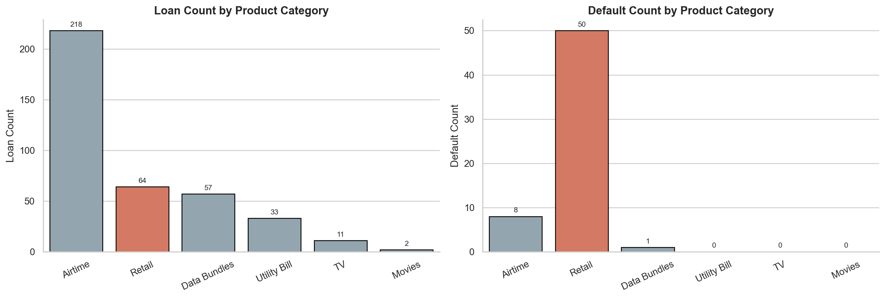
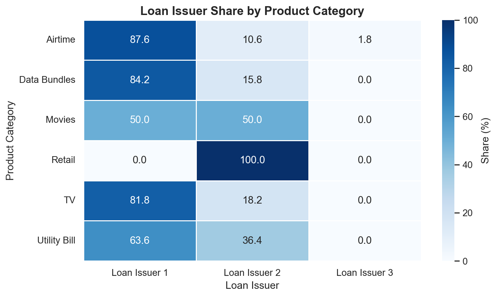
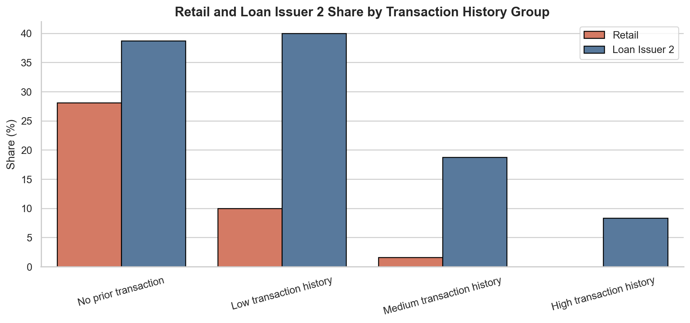
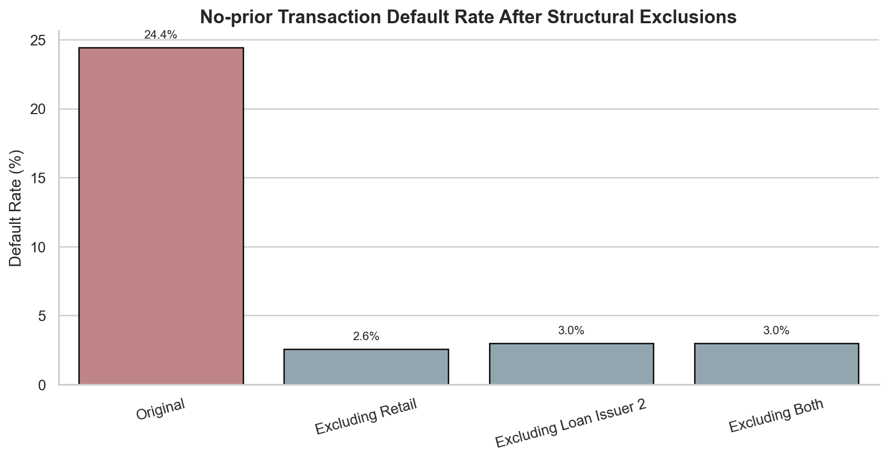
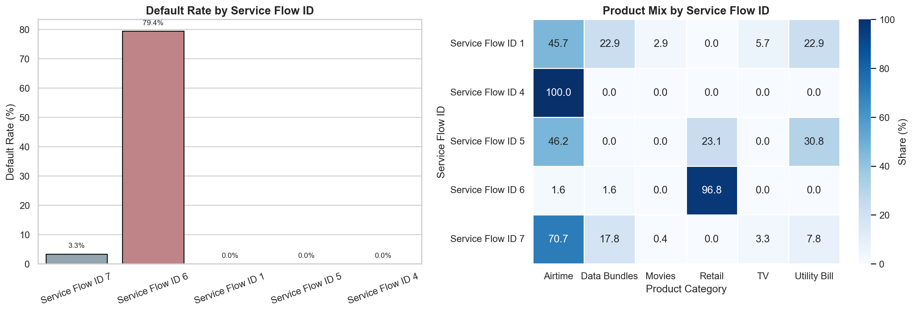
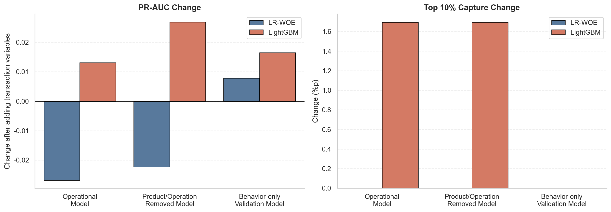
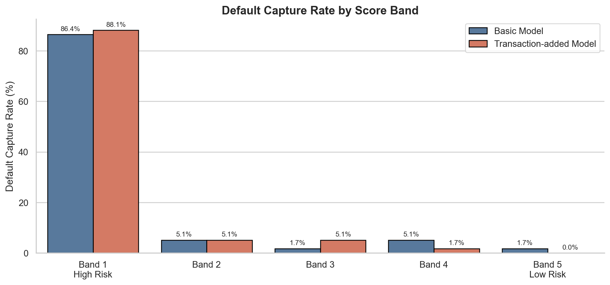

# 取引履歴のない顧客は、本当に高リスクなのか？

Xenteデータを用いて、**返済履歴のない顧客の信用リスク判断において、融資前の取引行動変数を主要な信用評価変数として採用できるか**を検証した、機械学習・信用評価分析プロジェクトです。

本プロジェクトは、単に「取引履歴のない顧客は危険である」と結論づけるものではありません。取引行動シグナルが顧客自身のリスクを説明しているのか、それとも特定の商品カテゴリ、貸付事業者、サービスフロー構造によって生じた見かけ上の関係なのかを、EDAとモデル検証を通じて切り分けます。

---

## 1. Overview

フィンテック融資では、返済履歴のない顧客を評価することが困難です。その顧客が実際に高リスクなのか、それとも判断に必要なデータがまだ十分に蓄積されていないだけなのかを区別しにくいためです。

Xenteは、ウガンダで決済、ショッピング、小口融資、後払いサービスを提供する電子商取引・金融サービスです。本データには、顧客の取引履歴と融資返済結果が含まれています。

本プロジェクトの中心となる問いは、次のとおりです。

> 返済履歴のない顧客の融資審査において、融資前の取引行動は独立した信用リスクシグナルとして利用できるか？

分析の結果、返済履歴のない顧客群は全融資の約34%でしたが、全未返済の約84.5%がこのグループで発生していました。表面的には、返済履歴のない顧客群は非常に重要なリスク管理対象に見えます。

しかし、より詳しく確認すると、取引履歴なしグループの高い未返済率は、単に「取引履歴がないから危険」という意味ではありませんでした。リテール商品カテゴリ、貸付事業者2、サービスフローID 6が同じグループへ集中し、この構造的セグメントで未返済が多発していました。

モデル検証でも、取引行動変数を追加した際にPR-AUCとTop 10% Captureが安定的に改善しませんでした。運用想定モデルでは、LR-WOEのPR-AUCは0.660から0.623へ低下し、LightGBMも0.652から0.638へ低下しました。

したがって、本プロジェクトの結論は次のとおりです。

> 現在のデータでは、取引行動変数を主要な信用評価変数として直ちに採用することは難しい。  
> 取引行動は補助的な観察変数として扱い、サービスフローID 6のように損失が集中する高リスクセグメントを優先的に管理する方が現実的である。

---

## 2. Problem & Objective

返済履歴のない顧客を過度に保守的に評価すると、実際には返済能力のある顧客まで取りこぼす可能性があります。一方、容易に承認すると未返済損失が拡大する可能性があります。

したがって、この問題は単に「高リスク顧客を否決すること」ではなく、**高リスク顧客を選別しながら、優良な新規顧客を逃さないための判断問題**です。

当初は、融資前の取引行動がこの判断を補完できると考えました。たとえば、融資前からプラットフォームを頻繁に利用し、直近まで取引があり、取引金額も安定している顧客であれば、返済履歴がなくても相対的に信頼できる可能性があります。

しかし、取引行動を直ちに信用リスクシグナルとして採用することにはリスクがあります。取引履歴がないという状態が顧客自身の行動によるものなのか、それとも特定の商品カテゴリ、貸付事業者、高額取引、運用構造が混在した結果なのかを確認する必要があるためです。

本プロジェクトの中心となる問いは、次のとおりです。

> 融資前の取引行動は、返済履歴のない顧客の未返済リスクを説明する独立したシグナルなのか。  
> それとも、特定の商品カテゴリ、貸付事業者、サービスフロー構造を表す代理シグナルなのか？

分析目標は、次の3点です。

1. 全融資を返済履歴の有無で分け、未返済がどこに集中しているかを確認する。
2. 返済履歴のない顧客群の中で、取引行動と未返済率の関係をEDAにより確認する。
3. 商品カテゴリ、貸付事業者、サービスフローID、金額、時間情報を考慮した後も、取引行動変数がモデル性能を安定的に改善するかを検証する。

---

## 3. Data

分析単位は顧客1人ではなく、**融資1件**です。

同じ顧客であっても、融資時点ごとに過去の取引履歴や返済履歴が異なる可能性があるためです。そのため、実際の審査時点に近い条件となるよう、各融資について融資実行前に観測可能な情報だけを使用しました。

| 設計基準 | 採用した方式 | 理由 |
|---|---|---|
| 分析単位 | 融資1件 | 同一顧客でも融資時点ごとに取引履歴とリスク条件が異なり得る |
| 基準時点 | 融資実行時点 | 実際の審査時に観測可能な情報だけを使用するため |
| 取引履歴 | 融資前の取引のみ使用 | 融資後の取引を使用すると将来情報のリークが発生する |
| 主な対象 | 返済履歴のない顧客群 | 既存返済記録だけでは評価が難しい顧客群 |

全融資件数は1,153件です。

| 顧客群 | 融資件数 | 構成比 |
|---|---:|---:|
| 返済履歴のある顧客群 | 757件 | 約65.7% |
| 返済履歴のない顧客群 | 396件 | 約34.3% |
| 全体 | 1,153件 | 100.0% |

融資件数だけを見ると、返済履歴のある顧客群の方が多くなっています。しかし、未返済が発生した場所を見ると状況が異なります。

| 区分 | 未返済件数 | 全未返済に占める比率 |
|---|---:|---:|
| 返済履歴のある顧客群 | 11件 | 約15.5% |
| 返済履歴のない顧客群 | 60件 | 約84.5% |
| 全体 | 71件 | 100.0% |

返済履歴のない顧客群は全融資の約34%にすぎませんでしたが、全未返済の約84.5%がこのグループで発生しました。



この図は、全顧客を一括してモデリングするだけでは不十分な理由を示しています。融資件数では返済履歴のある顧客群の方が大きい一方、実際の損失は返済履歴のない顧客群へ集中しています。そのため、以降の分析では返済履歴のない顧客群を分離して検証しました。

取引行動変数については、単に「取引履歴があるか」だけを確認したわけではありません。実際の審査判断を補完する情報として利用するには、活動性、直近性、取引の安定性、利用範囲を分けて確認する必要があると考えました。

| 判断上の問い | 観測指標 | 意思決定上の意味 |
|---|---|---|
| 融資前の取引履歴があるか | 取引履歴の有無、取引回数 | プラットフォームでの活動有無 |
| 直近まで利用していたか | 最終取引からの経過日数 | 活動の直近性 |
| 取引規模が安定しているか | 平均取引金額、金額変動性 | 取引パターンの安定性 |
| 多様な商品を利用していたか | 商品カテゴリ、商品、提供者の多様性 | プラットフォーム利用範囲 |

以降の分析では、これらの変数が未返済リスクを区別するのか、それとも特定の商品、貸付事業者、サービスフロー構造による見かけ上の関係なのかを段階的に確認しました。

---

## 4. Method / System Design

本プロジェクトの分析設計は、大きく2段階に分かれます。

第1段階はEDAです。返済履歴のない顧客群の中で、取引履歴区分ごとの未返済率を確認し、そのパターンが商品カテゴリ、貸付事業者、サービスフローIDとどのように結びついているかを探索しました。

第2段階はモデル検証です。EDAで有望に見えた取引行動変数が、実際にモデル性能を安定的に改善するかを確認しました。

### 4.1 EDA設計

EDAの中心は、「取引行動が未返済と関係しているように見える」という段階で結論を出さないことです。

最初に取引履歴区分別の未返済率を確認しました。その後、その差が顧客自身の行動によるものなのか、特定の商品カテゴリや貸付構造によるものなのかを確認するため、以下の順序で分析しました。

| 段階 | 確認内容 | 目的 |
|---|---|---|
| 1 | 取引履歴区分別の未返済率 | 取引行動がリスクシグナルに見えるかを確認 |
| 2 | 商品カテゴリ別の融資件数と未返済件数 | 未返済が特定の商品カテゴリへ集中しているかを確認 |
| 3 | 商品カテゴリと貸付事業者の構造 | リテールと特定事業者が結びついているかを確認 |
| 4 | 取引履歴別の構造的セグメント比率 | 取引履歴なしグループへリテール・事業者2が集中しているかを確認 |
| 5 | リテール／事業者2除外後の未返済率 | 取引履歴なし自体のシグナルが残るかを確認 |
| 6 | サービスフローID別の未返済率 | 実際の運用管理対象となる高リスクフローを確認 |

この段階の目的は、取引行動変数の「表面的なシグナル」と「構造的セグメント効果」を切り分けることです。

### 4.2 モデル検証設計

EDA後の中心的な問いは、「取引行動変数が未返済と関係しているか」ではありませんでした。より重要な問いは、次のとおりです。

> 商品カテゴリ、貸付事業者、サービスフローID、金額、時間情報を考慮した後も、取引行動変数は追加的なリスクシグナルとして残るか？

これを確認するため、同じモデル同士、同じ検証基準のもとで、ベースモデルと取引行動追加モデルを比較しました。

| 比較原則 | 設計 | 理由 |
|---|---|---|
| 同じモデル同士を比較 | LR-WOE同士、LightGBM同士を比較 | モデル差とfeature差を分離するため |
| 同じ検証基準を使用 | Customer-level Stratified Group K-Fold | 同一顧客が学習・検証へ同時に入るリークを防ぐため |
| ベースモデル vs 取引追加モデル | Basic → Basic + Transaction | 取引行動変数の追加情報価値を確認するため |
| 解釈可能モデル + 非線形モデル | LR-WOE + LightGBM | 信用評価型の基準モデルと非線形構造を併せて確認するため |

検証は、次の3つのtrackに分けました。

| Track | 目的 | 含有／除外情報 | 解釈 |
|---|---|---|---|
| 運用想定モデル | 実際の審査条件に近い比較 | 商品カテゴリ、貸付事業者、サービスフローID、金額、時間を含む | 運用情報に加えて取引行動が追加的に役立つかを確認 |
| 商品・運用要因除去モデル | 商品・事業者の影響を除去 | 商品カテゴリ、貸付事業者を除外 | 取引行動が商品・事業者構造の代理シグナルかを確認 |
| 行動変数単独検証モデル | 金額変数まで除去 | 商品カテゴリ、貸付事業者、金額を除外 | より厳しい条件でも取引行動シグナルが残るかを確認 |

評価では、単純なAccuracyよりも、未返済顧客をどの程度リスク上位区間へ配置できるかに重点を置きました。

| 評価基準 | 採用理由 | 変数採用判断における意味 |
|---|---|---|
| PR-AUC | 未返済件数が少なく、Accuracyは不適切 | 未返済顧客をどの程度区別できるかを確認 |
| Top 10% Capture | 実際の審査ではリスク上位群を優先管理 | 最も高リスクと評価した区間へ未返済がどの程度集中するかを確認 |
| Score Band | スコアが実際のリスク順位を作るかを確認 | High-risk区間ほど未返済率が高い必要がある |
| Group Permutation | feature importanceだけでは性能寄与を判断しにくい | 取引変数群をシャッフルした際に実際の性能が低下するかを確認 |

---

## 5. Implementation

本プロジェクトでは、EDA、feature generation、model validation、permutation analysis、score band analysisを分離して実装することを目標としました。

全体パイプラインは、以下のとおりです。

1. 元データから融資1件単位のテーブルを構築する。
2. 各融資について、融資実行前の取引だけを集計する。
3. 返済履歴の有無に基づき顧客群を分ける。
4. 返済履歴のない顧客群を中心にEDAを実施する。
5. 商品カテゴリ、貸付事業者、サービスフローIDと取引行動変数の交絡を確認する。
6. Basic feature setと取引行動追加feature setを構築する。
7. LR-WOEとLightGBMでモデル比較を行う。
8. Customer-level Stratified Group K-Foldで検証する。
9. PR-AUC、Top 10% Capture、Score Bandを計算する。
10. Group Permutationにより変数群の実質的な性能寄与を確認する。

成果物は、大きく2種類です。

| 成果物 | 保存先 | 役割 |
|---|---|---|
| EDA図 | `outputs/figures/` | 構造的な見かけ上の関係と高リスクセグメントを説明 |
| モデル結果表 | `outputs/tables/` | BasicとTransaction追加モデルの性能比較・検証結果 |

---

## 6. Evaluation

検証の結果、取引行動変数の追加は安定的な性能改善につながりませんでした。

本プロジェクトのEvaluationは、図と表を合わせて、次の流れで読むことができます。

1. 取引履歴なしは、当初は強いリスクシグナルに見えた。
2. しかし、そのシグナルはリテール、貸付事業者2、サービスフローID 6と強く結びついていた。
3. モデルへ取引行動変数を追加しても、性能は安定的に改善しなかった。
4. 実際の高リスク区間における未返済捕捉力も改善しなかった。

---

### 6.1 取引履歴なしは、当初は強いリスクシグナルに見えた

返済履歴のない顧客群の中で取引履歴区分別の未返済率を確認すると、取引履歴なしグループが最も高リスクに見えます。

| 取引履歴区分 | 未返済率 | 解釈 |
|---|---:|---|
| 取引履歴なし | 23.6% | 最も高いリスク区間に見える |
| 取引履歴が少ない | 約5%台 | 低い未返済率 |
| 取引履歴が中程度 | 約5%台 | 低い未返済率 |
| 取引履歴が多い | 0.0% | 未返済なし |



この図だけを見ると、取引行動は返済履歴のない顧客のリスクを説明する有望なシグナルに見えます。取引履歴のない顧客群の未返済率が最も高く、取引履歴が多いグループでは未返済が観測されなかったためです。

しかし、この段階で直ちに「取引履歴がなければ危険」と結論づけてはいけません。取引履歴なしグループへ、特定の商品カテゴリ、貸付事業者、サービスフローが同時に集中している可能性があるためです。

---

### 6.2 未返済はリテール商品カテゴリへ集中していた

次に、商品カテゴリ別の全融資件数と未返済件数を比較しました。

全融資件数だけを見ると通信料金カテゴリが最も多い一方、未返済はリテールカテゴリへ大きく集中していました。



この図は、解釈上の重要な転換点を示します。取引履歴なしグループの高い未返済率を顧客行動だけで説明する前に、未返済が特定の商品カテゴリへ異常に集中していないかを確認する必要があります。

つまり、「取引履歴がないから危険」なのではなく、「取引履歴のない顧客群にリテール融資が多く含まれているため、高リスクに見える」という可能性を検討する必要があります。

---

### 6.3 リテールは特定の貸付事業者と強く結びついていた

リテールの高い未返済率が単純な商品カテゴリ効果なのかを確認するため、商品カテゴリと貸付事業者の構造を併せて確認しました。



その結果、リテールは貸付事業者2と強く結びついていました。

この時点で、取引行動変数の解釈にはさらに注意が必要になります。取引履歴なしグループは、単に「プラットフォーム利用経験のない顧客」だけを意味するのではなく、特定の商品カテゴリと特定の貸付構造が混在するグループである可能性があるためです。

---

### 6.4 取引履歴なしグループには、構造的な高リスクセグメントが集中していた

取引履歴区分ごとに、リテールと貸付事業者2の構成比を確認しました。



この図は、取引履歴なしグループにリテールと貸付事業者2が相対的に多く含まれていることを示しています。

したがって、取引履歴区分別の未返済率差は、顧客のプラットフォーム利用行動だけでは説明できない可能性があります。取引履歴なしグループは、単に取引がない顧客群ではなく、特定の商品カテゴリと貸付構造が混在した顧客群である可能性がありました。

---

### 6.5 構造的セグメントを除外すると、取引履歴なしのリスクシグナルは大きく弱まった

この仮説を確認するため、リテールと貸付事業者2を除外した後、取引履歴なしグループの未返済率を再計算しました。

| 条件 | 取引履歴なしグループの未返済率 | 解釈 |
|---|---:|---|
| 全体 | 23.6% | 取引履歴なしが高リスクに見える |
| リテール除外 | 2.4% | リテール集中を除くとリスクシグナルが大きく弱まる |
| 貸付事業者2除外 | 2.9% | 事業者構造を除いてもリスクシグナルが大きく弱まる |



この結果は、本プロジェクトの中心的な発見です。

取引履歴なしグループの高い未返済率は、取引行動そのものによる独立したリスクシグナルというよりも、リテールや貸付事業者2のような構造的セグメントが混在した結果である可能性が高いと考えられます。

したがって、取引行動変数を信用評価の主要変数として採用する前に、商品カテゴリと運用構造の影響を必ず切り分ける必要があります。

---

### 6.6 サービスフローID 6が実際の高リスク区間だった

元データにおける構造IDの定義は包括的であり、正確な内部意味を断定することは困難です。そのため、本分析では、商品カテゴリ、貸付事業者、利用フローを組み合わせたサービスフローIDとして解釈しました。

サービスフローID別の商品カテゴリ構成と未返済集中度を確認した結果、ID 6で未返済が異常に集中していました。

| サービスフローID | 全件数 | リテール件数 | 未返済件数 | 未返済率 | 解釈 |
|---|---:|---:|---:|---:|---|
| ID 6 | 63件 | 61件 | 50件 | 79.4% | リテールと未返済が強く集中した高リスクフロー |
| ID 7 | 280件 | - | 10件 | 約3.6% | 融資件数は多いが未返済集中度は低い |



この結果により、運用判断が変わります。

問題は「取引履歴のない顧客全体」ではなく、**サービスフローID 6に代表される高リスク構造**でした。そのため、取引履歴のない顧客を一律に高リスク扱いするのではなく、損失が集中したサービスフローを優先的に管理する方が現実的です。

---

### 6.7 取引行動変数の追加は、モデル性能を安定的に改善しなかった

EDA後は、取引行動変数が実際にモデル性能を改善するかを確認しました。

運用想定モデルでは、実際の審査条件に近い情報、すなわち商品カテゴリ、貸付事業者、サービスフローID、金額、時間情報を含めた状態で取引行動変数を追加しました。

| モデル | Feature Set | PR-AUC | Top 10% Capture | 上位10%で捕捉した未返済数 | 解釈 |
|---|---|---:|---:|---:|---|
| LR-WOE | Basic | 0.660 | 51.7% | 31件 / 60件 | ベースモデル |
| LR-WOE | Basic + Transaction | 0.623 | 50.0% | 30件 / 60件 | 取引変数追加後に性能低下 |
| LightGBM | Basic | 0.652 | 50.0% | 30件 / 60件 | ベースモデル |
| LightGBM | Basic + Transaction | 0.638 | 48.3% | 29件 / 60件 | 取引変数追加後に性能低下 |



数十個の取引行動変数を追加しましたが、運用想定モデルではPR-AUCとTop 10% Captureのいずれも改善しませんでした。

上位10%のリスク群で実際の未返済を何件捕捉したかを見ると、差はより直感的です。LR-WOEでは31件から30件へ減少し、LightGBMでは30件から29件へ減少しました。

つまり、取引行動変数は、実運用で重要な「高リスク上位群の捕捉力」を改善しませんでした。

---

### 6.8 Permutation検証でも、取引行動の寄与は小さかった

モデルのfeature importanceだけを見ると、取引行動変数が重要に見える可能性があります。しかし、実際にその変数群をシャッフルした際に性能がどの程度低下するかを確認する必要があります。

Group Permutationの結果は、以下のとおりです。

| 検証条件 | 変数群 | PR-AUC損失 | 解釈 |
|---|---|---:|---|
| 運用想定モデル | 金額変数群 | 0.312 | 最も大きな性能寄与 |
| 運用想定モデル | 取引行動の活動性・直近性・回数変数群 | 約0.001 | 性能寄与はほぼない |
| 商品・運用要因除去モデル | 金額変数群 | 0.206 | 引き続き大きな性能寄与 |
| 商品・運用要因除去モデル | 時間・サービスフローID系変数群 | 0.197 | 構造的フロー情報が重要 |
| 商品・運用要因除去モデル | 取引行動変数群 | 小さい、または負 | 安定した性能寄与なし |

この結果は、モデルのリスク順位を実質的に支えたシグナルが、取引行動よりも金額、時間、サービスフローID系の変数に近かったことを示しています。

つまり、取引行動変数はEDAでは有望に見えましたが、実際のモデル性能へ独立して寄与した主要変数群ではありませんでした。

---

### 6.9 Score Bandでも、高リスク区間の捕捉力は改善しなかった

実運用では、全体的なスコア性能よりも高リスク上位区間が重要です。審査部門はすべての顧客を同じように確認するのではなく、リスクスコアが高い区間から優先的に確認するためです。

スコア区間別に確認したところ、Basicモデルは最も高いリスク区間で全未返済の83.3%を捕捉しました。取引変数追加モデルも同じ区間で83.3%を捕捉しました。

| モデル | 最高リスク区間の未返済捕捉率 | 解釈 |
|---|---:|---|
| Basic | 83.3% | 高リスク区間で大半の未返済を捕捉 |
| Basic + Transaction | 83.3% | 取引行動変数追加後も改善なし |



つまり、取引行動変数を追加しても、実運用で重要な高リスク区間の未返済捕捉力は改善しませんでした。

結論として、取引行動変数はEDA段階では有望に見えましたが、現在のデータでは主要な信用評価変数として採用できるほど安定した追加価値を確認できませんでした。

---

## 7. Key Design Decisions

### なぜ顧客単位ではなく、融資1件単位で分析したのか？

同じ顧客でも、融資時点ごとに過去の取引履歴と返済履歴が異なる可能性があります。

信用評価で重要なのは、「その顧客が過去にどのような人物だったか」だけではなく、特定の融資申請時点でどの情報が観測可能だったかです。そのため、分析単位を顧客ではなく融資1件としました。

### なぜ融資前の取引だけを使用したのか？

融資後の取引をfeatureとして使用すると、将来情報のリークが発生します。

実際の審査時点では、融資後の取引を知ることはできません。そのため、すべての取引行動変数は融資実行前の取引だけを用いて構築しました。

### なぜ返済履歴のない顧客群を分離したのか？

全未返済71件のうち60件、約84.5%が返済履歴のない顧客群で発生していました。

全体モデルにこのグループを混在させると、返済履歴という強い情報が他のシグナルを覆い隠す可能性があります。そのため、返済履歴のない顧客群を分離し、そのグループ内で取引行動が追加的な判断情報を提供するかを確認しました。

### なぜEDAで直ちに結論を出さなかったのか？

取引履歴なしグループの未返済率は23.6%と高い値でした。しかし、このグループにはリテール、貸付事業者2、サービスフローID 6が同時に集中していました。

そのため、取引履歴なしが実際のリスクシグナルなのか、それとも構造的セグメントの代理シグナルなのかを切り分ける必要がありました。

### なぜ同じモデル同士を比較したのか？

取引行動変数の追加価値を確認するには、モデル差とfeature差を分離する必要があります。

LR-WOEとLightGBMを直接比較すると、モデル構造の違いが混在します。そのため、LR-WOEはLR-WOE同士、LightGBMはLightGBM同士で、BasicとBasic + Transactionを比較しました。

### なぜCustomer-level Group K-Foldを使用したのか？

同じ顧客が複数の融資を持つ場合があります。同一顧客の融資が学習と検証へ同時に入ると、モデルが顧客特性を記憶するリークが生じる可能性があります。

これを防ぐため、顧客単位でfoldを分けるStratified Group K-Foldを使用しました。

### なぜPR-AUCとTop 10% Captureを使用したのか？

未返済件数が少ないため、Accuracyは適切ではありません。大部分を正常返済と予測するだけでも、Accuracyは高く見える可能性があります。

実運用ではリスク上位区間を優先して確認するため、PR-AUCとTop 10% Captureの方が重要です。

---

## 8. Development Notes

本プロジェクトは、当初「取引履歴のない顧客は高リスクなのか」という問いから始まりました。

初期EDAでは、取引履歴なしグループの未返済率が23.6%で最も高く、取引履歴が多いグループでは未返済率が0%でした。この結果だけを見ると、取引行動変数は非常に有望に見えました。

しかし、商品カテゴリ別に未返済を分解すると、解釈が変わりました。全融資件数では通信料金カテゴリが多い一方、未返済はリテールへ集中していました。

次に、リテールと貸付事業者2が強く結びついていることを確認しました。取引履歴なしグループにはリテールと貸付事業者2が多く含まれていましたが、取引履歴が多いグループではほとんど見られませんでした。

リテールを除外すると、取引履歴なしグループの未返済率は23.6%から2.4%へ低下しました。貸付事業者2を除外した場合も2.9%まで低下しました。

最大の転換点は、サービスフローID 6でした。サービスフローID 6では、全63件のうち61件がリテールであり、63件のうち50件が未返済でした。未返済率は79.4%でした。一方、融資件数が最も多いサービスフローID 7では、280件のうち未返済は10件だけでした。

この過程を通じて、問いそのものが変化しました。

当初の問いは、次のとおりでした。

> 取引履歴のない顧客は高リスクなのか？

最終的な問いは、次のようになりました。

> 取引行動変数は、リテール、貸付事業者、サービスフロー構造を考慮した後も、独立した信用リスクシグナルとして残るか？

モデル検証の結果、取引行動変数の追加は安定した性能改善を生みませんでした。そのため、最終結論は取引行動変数の採用ではなく、高リスクサービスフローを優先的に管理する方向へ整理されました。

---

## 9. Limitations

本プロジェクトは公開データに基づく分析であり、いくつかの限界があります。

1. サービスフローIDの実際の内部意味は確認できません。本文では商品カテゴリ、貸付事業者、利用フローを組み合わせたサービスフローIDとして解釈しましたが、実際には商品方針、契約単位、後払いフロー、運用キャンペーンなど複数の可能性があります。
2. 全未返済件数は71件であり、返済履歴のない顧客群の未返済件数は60件です。標本が小さいため、一部の性能差はデータ分割や標本構成によって変動する可能性があります。
3. 取引行動変数は現在のデータ内でのみ検証されています。別期間、別商品カテゴリ、別の融資方針では結果が異なる可能性があります。
4. 外部信用情報や本人確認レベルなど、重要な情報が含まれていません。実際の信用評価では、内部取引行動だけでなく、外部信用情報と本人確認レベルも必要になる可能性があります。
5. 本分析は政策実験ではありません。取引行動変数を採用した場合に、実際の承認率、損失率、顧客流入がどのように変化するかは、別途運用実験で確認する必要があります。

したがって、現在のデータでは取引行動変数を主要な信用評価変数として直ちに採用するよりも、補助的な観察変数として扱い、高リスクサービスフローを優先的に管理する方が現実的な判断です。

---

## 10. How to Run

### Install dependencies

```bash
pip install -r requirements.txt
```

### Run the full pipeline

```bash
PYTHONPATH=$PWD:$PYTHONPATH python scripts/run_all.py
```

### Run each step separately

```bash
PYTHONPATH=$PWD:$PYTHONPATH python scripts/00_prepare_loan_level_table.py
PYTHONPATH=$PWD:$PYTHONPATH python scripts/01_eda_no_repayment_history.py
PYTHONPATH=$PWD:$PYTHONPATH python scripts/02_eda_structural_confounding.py
PYTHONPATH=$PWD:$PYTHONPATH python scripts/03_train_operational_models.py
PYTHONPATH=$PWD:$PYTHONPATH python scripts/04_ablation_models.py
PYTHONPATH=$PWD:$PYTHONPATH python scripts/05_group_permutation.py
PYTHONPATH=$PWD:$PYTHONPATH python scripts/06_score_band_analysis.py
```

実行結果は`outputs/`フォルダへ保存されます。

EDA図は`outputs/figures/`、モデル結果表は`outputs/tables/`へ保存する構成です。

---

## 11. Project Structure

```text
xente-credit-feature-adoption/
├── README.md
├── requirements.txt
├── data/
│   ├── raw/
│   └── processed/
├── notebooks/
│   ├── 01_eda_transaction_history.ipynb
│   ├── 02_structural_confounding_checks.ipynb
│   ├── 03_model_validation.ipynb
│   └── 04_operational_decision.ipynb
├── scripts/
│   ├── 00_prepare_loan_level_table.py
│   ├── 01_eda_no_repayment_history.py
│   ├── 02_eda_structural_confounding.py
│   ├── 03_train_operational_models.py
│   ├── 04_ablation_models.py
│   ├── 05_group_permutation.py
│   ├── 06_score_band_analysis.py
│   └── run_all.py
├── src/
│   └── xente_credit/
│       ├── features.py
│       ├── validation.py
│       ├── metrics.py
│       └── plotting.py
└── outputs/
    ├── figures/
    └── tables/
```

READMEでは、EDA図、モデル結果表、permutation結果、score band結果の保存先が明確に分かるように構成しています。

---

## 12. What This Project Demonstrates

本プロジェクトは、取引行動変数を信用評価モデルへ追加すべきかを判断するfeature adoption分析です。

1. 予測性能が高く見える変数を直ちに採用せず、その変数が実際の顧客リスクを説明しているのか、構造的な見かけ上の関係なのかを確認しました。
2. 融資1件単位で基準時点をそろえ、融資前の取引だけを使用することで将来情報のリークを防ぎました。
3. 返済履歴のない顧客群を分離し、実際に評価が難しい顧客群における取引行動の追加価値を検証しました。
4. EDAにより、取引履歴なしグループの高い未返済率が、リテール、貸付事業者2、サービスフローID 6と強く結びついていることを確認しました。
5. LR-WOEとLightGBMを同じ条件で比較し、取引行動変数の追加的な性能寄与を検証しました。
6. Customer-level Stratified Group K-Foldを使用し、同一顧客が学習と検証へ同時に入るリークを防ぎました。
7. PR-AUC、Top 10% Capture、Score Band、Group Permutationを用いて、実運用で重要な高リスク上位区間の捕捉力を評価しました。
8. 最終的に、取引行動変数を主要な信用評価変数として直ちに採用せず、高リスクサービスフローを優先管理する運用判断へ接続しました。

本プロジェクトの中心は、単にモデルを学習したことではなく、**有望に見えるfeatureを実際の信用評価変数として採用してよいかを検証し、採用しない判断までデータで説明したこと**です。
